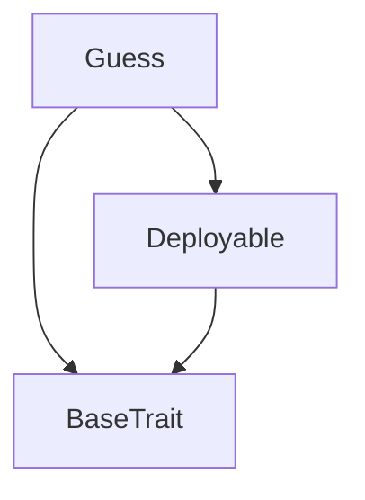

# Tact compilation report
Contract: Guess
BoC Size: 1297 bytes

## Structures (Structs and Messages)
Total structures: 20

### DataSize
TL-B: `_ cells:int257 bits:int257 refs:int257 = DataSize`
Signature: `DataSize{cells:int257,bits:int257,refs:int257}`

### SignedBundle
TL-B: `_ signature:fixed_bytes64 signedData:remainder<slice> = SignedBundle`
Signature: `SignedBundle{signature:fixed_bytes64,signedData:remainder<slice>}`

### StateInit
TL-B: `_ code:^cell data:^cell = StateInit`
Signature: `StateInit{code:^cell,data:^cell}`

### Context
TL-B: `_ bounceable:bool sender:address value:int257 raw:^slice = Context`
Signature: `Context{bounceable:bool,sender:address,value:int257,raw:^slice}`

### SendParameters
TL-B: `_ mode:int257 body:Maybe ^cell code:Maybe ^cell data:Maybe ^cell value:int257 to:address bounce:bool = SendParameters`
Signature: `SendParameters{mode:int257,body:Maybe ^cell,code:Maybe ^cell,data:Maybe ^cell,value:int257,to:address,bounce:bool}`

### MessageParameters
TL-B: `_ mode:int257 body:Maybe ^cell value:int257 to:address bounce:bool = MessageParameters`
Signature: `MessageParameters{mode:int257,body:Maybe ^cell,value:int257,to:address,bounce:bool}`

### DeployParameters
TL-B: `_ mode:int257 body:Maybe ^cell value:int257 bounce:bool init:StateInit{code:^cell,data:^cell} = DeployParameters`
Signature: `DeployParameters{mode:int257,body:Maybe ^cell,value:int257,bounce:bool,init:StateInit{code:^cell,data:^cell}}`

### StdAddress
TL-B: `_ workchain:int8 address:uint256 = StdAddress`
Signature: `StdAddress{workchain:int8,address:uint256}`

### VarAddress
TL-B: `_ workchain:int32 address:^slice = VarAddress`
Signature: `VarAddress{workchain:int32,address:^slice}`

### BasechainAddress
TL-B: `_ hash:Maybe int257 = BasechainAddress`
Signature: `BasechainAddress{hash:Maybe int257}`

### Deploy
TL-B: `deploy#946a98b6 queryId:uint64 = Deploy`
Signature: `Deploy{queryId:uint64}`

### DeployOk
TL-B: `deploy_ok#aff90f57 queryId:uint64 = DeployOk`
Signature: `DeployOk{queryId:uint64}`

### FactoryDeploy
TL-B: `factory_deploy#6d0ff13b queryId:uint64 cashback:address = FactoryDeploy`
Signature: `FactoryDeploy{queryId:uint64,cashback:address}`

### NewSession
TL-B: `new_session#00000001 queryId:uint64 newAnchor:uint256 = NewSession`
Signature: `NewSession{queryId:uint64,newAnchor:uint256}`

### SetOwner
TL-B: `set_owner#00000002 queryId:uint64 owner:address = SetOwner`
Signature: `SetOwner{queryId:uint64,owner:address}`

### Withdraw
TL-B: `withdraw#00000003 queryId:uint64 amount:coins address:address = Withdraw`
Signature: `Withdraw{queryId:uint64,amount:coins,address:address}`

### Deposit
TL-B: `deposit#00000004 queryId:uint64 amount:coins = Deposit`
Signature: `Deposit{queryId:uint64,amount:coins}`

### DepositEvent
TL-B: `deposit_event#7362d09c player:address amount:coins timestamp:uint32 = DepositEvent`
Signature: `DepositEvent{player:address,amount:coins,timestamp:uint32}`

### WithdrawEvent
TL-B: `withdraw_event#85007c9f player:address amount:coins timestamp:uint32 = WithdrawEvent`
Signature: `WithdrawEvent{player:address,amount:coins,timestamp:uint32}`

### Guess$Data
TL-B: `_ owner:address anchor:uint256 totalDeposits:coins = Guess`
Signature: `Guess{owner:address,anchor:uint256,totalDeposits:coins}`

## Get methods
Total get methods: 7

## get_owner
No arguments

## get_anchor
No arguments

## get_total_deposits
No arguments

## verifyRound
Argument: serverSeed
Argument: roomSeed
Argument: nonce
Argument: claimedResult

## verifyRoundSlice
Argument: serverSeedSlice
Argument: roomSeedSlice
Argument: nonce
Argument: claimedResult

## calculateResult
Argument: serverSeed
Argument: roomSeed
Argument: nonce

## verifyChainLink
Argument: seedNextSlice
Argument: seedCurrentSlice

## Exit codes
* 2: Stack underflow
* 3: Stack overflow
* 4: Integer overflow
* 5: Integer out of expected range
* 6: Invalid opcode
* 7: Type check error
* 8: Cell overflow
* 9: Cell underflow
* 10: Dictionary error
* 11: 'Unknown' error
* 12: Fatal error
* 13: Out of gas error
* 14: Virtualization error
* 32: Action list is invalid
* 33: Action list is too long
* 34: Action is invalid or not supported
* 35: Invalid source address in outbound message
* 36: Invalid destination address in outbound message
* 37: Not enough Toncoin
* 38: Not enough extra currencies
* 39: Outbound message does not fit into a cell after rewriting
* 40: Cannot process a message
* 41: Library reference is null
* 42: Library change action error
* 43: Exceeded maximum number of cells in the library or the maximum depth of the Merkle tree
* 50: Account state size exceeded limits
* 128: Null reference exception
* 129: Invalid serialization prefix
* 130: Invalid incoming message
* 131: Constraints error
* 132: Access denied
* 133: Contract stopped
* 134: Invalid argument
* 135: Code of a contract was not found
* 136: Invalid standard address
* 138: Not a basechain address
* 31257: Withdrawal is only allowed for owner
* 39000: FORBIDDEN
* 46182: Insufficient balance in contract
* 49729: Unauthorized

## Trait inheritance diagram

## Contract dependency diagram

